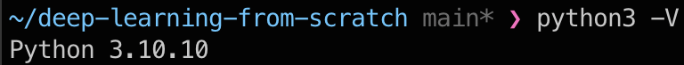
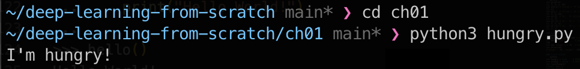
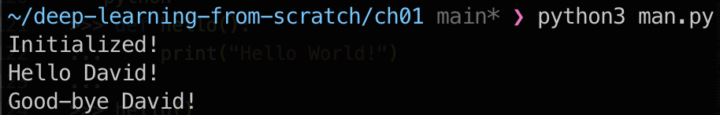
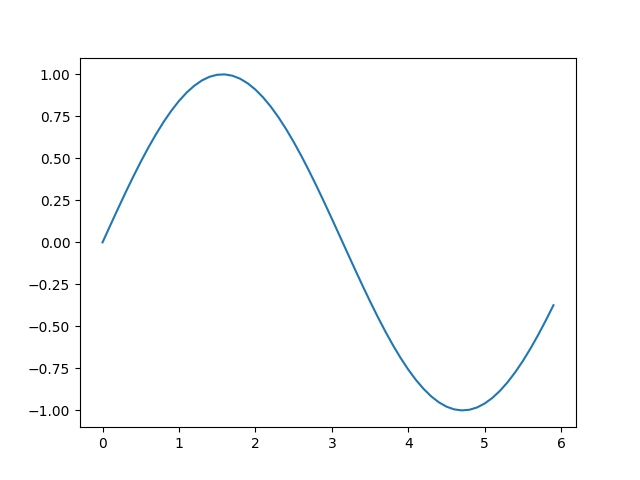
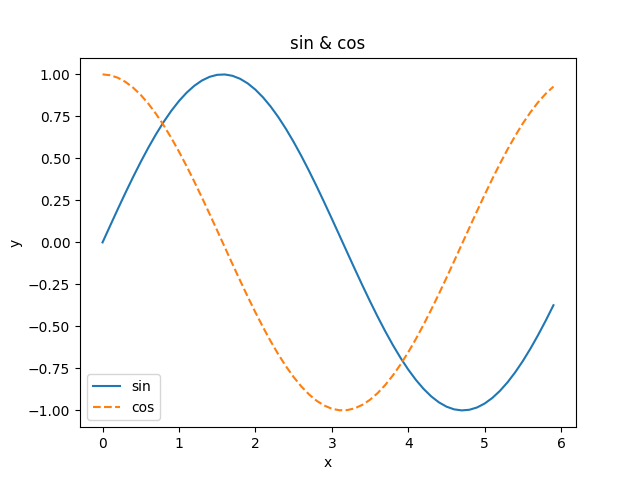
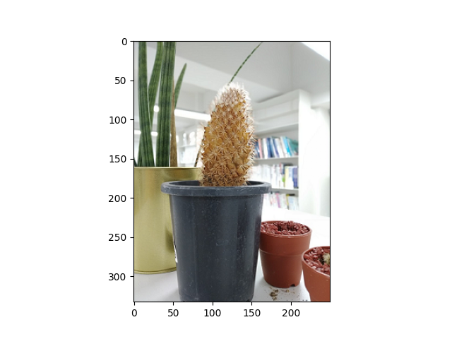

# 헬로 파이썬
## 1.1 파이썬이란?
## 1.2 파이썬 설치하기
### 1.2.1 파이썬 버전
3.10.10
## 1.3 파이썬 인터프리터

### 1.3.1 산술 연산
```python
>>> 1 - 2
-1
>>> 4 * 5
20
>>> 7 / 5
1.4
>>> 3 ** 2
9
```
### 1.3.2 자료형
```python
>>> type(10)
<class 'int'>
>>> type(2.718)
<class 'float'>
>>> type("hello")
<class 'str'>
```
### 1.3.3 변수
```python
>>> x = 10   # 초기화
>>> print(x) # x의 값 출력
10
>>> x = 100  # 변수에 값 대입
>>> print(x)
100
>>> y = 3.14
>>> x * y
314.0
>>> type(x * y)
<class 'float'>
```
### 1.3.4 리스트
```python
>>> a = [1, 2, 3, 4, 5] # 리스트 생성
>>> print(a)  # 리스트의 내용 출력
[1, 2, 3, 4, 5]
>>> len(a)     # 리스트의 길이 출력
5
>>> a[0]      # 첫 원소에 접근
1
>>> a[4]      # 다섯 번째 원소에 접근
5
>>> a[4] = 99 # 값 대입
>>> print(a)
[1, 2, 3, 4, 99]
```
```python
>>> print(a)
[1, 2, 3, 4, 99]
>>> a[0:2] # 인덱스 0부터 2까지 얻기(2번째는 포함하지 않는다!)
[1, 2]
>>> a[1:]  # 인덱스 1부터 끝까지 얻기
[2, 3, 4, 99]
>>> a[:3]  # 처음부터 인덱스 3까지 얻기(3번째는 포함하지 않는다!)
[1, 2, 3]
>>> a[:-1] # 처음부터 마지막 원소의 1개 앞까지 얻기
[1, 2, 3, 4]
>>> a[:-2] # 처음부터 마지막 원소의 2개 앞까지 얻기
[1, 2, 3]
```
### 1.3.5 사전
```python
>>> me = {'height': 180} # 딕셔너리 생성
>>> me['height']        # 원소에 접근
180
>>> me['weight'] = 70   # 새 원소 추가
>>> print(me)
{'weight': 70, 'height': 180}
```
### 1.3.6 불리언
```python
>>> hungry = True     # 배가 고프다.
>>> sleepy = False    # 졸리지 않다.
>>> type(hungry)
<class 'bool'>
>>> not hungry
False
>>> hungry and sleepy # 배가 고프다 그리고 졸리지 않다.
False
>>> hungry or sleepy  # 배가 고프다 또는 졸리지 않다.
True
```
### 1.3.7 if 문
```python
>>> hungry = True
>>> if hungry:
...     print("I'm hungry")
...
I'm hungry
>>> hungry = False
>>> if hungry:
...     print("I'm hungry")   # 들여쓰기는 공백 문자로
... else:
...     print("I'm not hungry")
...     print("I'm sleepy")
...
I'm not hungry
I'm sleepy
```
### 1.3.8 for 문
```python
>>> for i in[1, 2, 3]:
...     print(i)
...
1
2
3
```
### 1.3.9 함수
```python
>>> def hello():
...     print("Hello World!")
...
>>> hello()
Hello World!
```
```python
>>> def hello(object):
...     print("Hello " + object + "!")
...
>>> hello("cat")
Hello cat!
```
## 1.4 파이썬 스크립트 파일
### 1.4.1 파일로 저장하기

### 1.4.2 클래스

## 1.5 넘파이
### 1.5.1 넘파이 가져오기
```python
>>> import numpy as np
```
### 1.5.2 넘파이 배열 생성하기
```python
>>> x = np.array([1.0, 2.0, 3.0])
>>> print(x)
[1. 2. 3.]
>>> type(x)
<class 'numpy.ndarray'>
```
### 1.5.3 넘파이의 산술 연산
```python
>>> x = np.array([1.0, 2.0, 3.0])
>>> y = np.array([2.0, 4.0, 6.0])
>>> x + y # 원소별 덧셈
array([ 3., 6., 9.])
>>> x - y
array([ -1., -2., -3.])
>>> x * y # 원소별 곱셈
array([ 2., 8., 18.])
>>> x / y
array([ 0.5, 0.5, 0.5])
```
```python
>>> x = np.array([1.0, 2.0, 3.0])
>>> x / 2.0
array([ 0.5, 1., 1.5])
```
### 1.5.4 넘파이의 N차원 배열
```python
>>> A = np.array([[1, 2], [3, 4]])
>>> print(A)
[[1 2]
 [3 4]]
>>> A.shape
(2, 2)
>>> A.dtype
dtype('int64')
```
```python
>>> B = np.array([[3, 0], [0, 6]])
>>> A + B
array([[ 4, 2],
       [ 3, 10]])
>>> A * B
array([[ 3, 0],
       [ 0, 24]])
```
```python
>>> print(A)
[[1 2]
 [3 4]]
>>> A * 10
array([[ 10, 20],
       [ 30, 40]])
```
### 1.5.5 브로드캐스트
```python
>>> A = np.array([[1, 2], [3, 4]])
>>> B = np.array([10, 20])
>>> A * B
array([[ 10, 40],
       [ 30, 80]])
```
### 1.5.6 원소 접근
```python
>>> X = np.array([[51, 55], [14, 19], [0, 4]])
>>> print(X)
[[51 55]
 [14 19]
 [ 0 4]]
>>> X[0]     # 0행
array([51, 55])
>>> X[0][1]  # (0, 1) 위치의 원소
55
```
```python
>>> for row in X:
...     print(row)
...
[51 55]
[14 19]
[0 4]
```
```python
>>> X = X.flatten()        # X를 1차원 배열로 변환(평탄화)
>>> print(X)
[51 55 14 19 0 4]
>>> X[np.array([0, 2, 4])] # 인덱스가 0, 2, 4인 원소 얻기
array([51, 14, 0])
```
```python
>>> X > 15
array([ True, True, False, True, False, False], dtype = bool)
>>> X[X>15]
array([51, 55, 19])
```
## 1.6 matplotlib
### 1.6.1 단순한 그래프 그리기

### 1.6.2 pyplot의 기능

### 1.6.3 이미지 표시하기

## 1.7 정리
> **이번 장에서 배운 내용**
* 파이썬은 간단하고 익히기 쉬운 프로그래밍 언어다.
* 파이썬은 오픈 소스여서 자유롭게 사용할 수 있다.
* 이 책은 딥러닝 구현에 파이썬 3 버전을 이용한다.
* 외부 라이브러리로는 넘파이와 matplotlib을 이용한다.
* 파이썬을 실행하는 방식에는 ‘인터프리터’와 ‘스크립트 파일’ 두 가지가 있다.
* 파이썬에서는 함수와 클래스 같은 모듈로 구현을 정리할 수 있다.
* 넘파이는 다차원 배열을 다루는 편리한 메서드를 많이 제공한다.