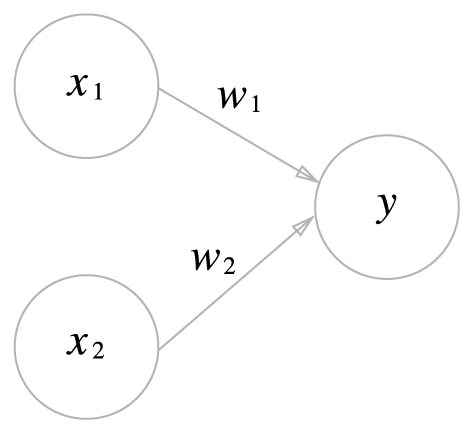

# 퍼셉트론
퍼셉트론이란 신경망(딥러닝)의 기원이 되는 알고리즘
## 2.1 퍼셉트론이란?
퍼셉트론은 다수의 신호를 입력으로 받아 하나의 신호를 출력



수식으로 나타내면


## 2.2 단순한 논리 회로 
### 2.2.1 AND 게이트
AND 게이트 진리표


### 2.2.2 NAND 게이트와 OR 게이트 
NAND 게이트 진리표


OR 게이트 진리표


## 2.3 퍼셉트론 구현하기 
### 2.3.1 간단한 구현부터 
AND Function
```python
def AND(x1, x2):
    w1, w2, theta = 0.5, 0.5, 0.7
    tmp = x1*w1 + x2*w2
    if tmp <= theta:
        return 0
    elif tmp > theta:
        return 1
```
### 2.3.2 가중치와 편향 도입 
Θ를 -b로 치환


### 2.3.3 가중치와 편향 구현하기 
- [AND_gate](and_gate.py)
- [NAND_gate](nand_gate.py)
- [OR_gate](or_gate.py)
## 2.4 퍼셉트론의 한계 
### 2.4.1 도전! XOR 게이트 
XOR 게이트 진리표


XOR 영역


### 2.4.2 선형과 비선형 
비선형 영역


## 2.5 다층 퍼셉트론이 출동한다면 
### 2.5.1 기존 게이트 조합하기 
AND, NAND, OR 게이트를 조합하여 XOR 게이트 구현


XOR 게이트의 진리표


### 2.5.2 XOR 게이트 구현하기 
- [XOR_gate](xor_gate.py)


## 2.6 NAND에서 컴퓨터까지
## 2.7 정리
> **이번 장에서 배운 내용**
* 퍼셉트론은 입출력을 갖춘 알고리즘이다. 입력을 주면 정해진 규칙에 따른 값을 출력한다.
* 퍼셉트론에서는 ‘가중치’와 ‘편향’을 매개변수로 설정한다.
* 퍼셉트론으로 AND, OR 게이트 등의 논리 회로를 표현할 수 있다.
* XOR 게이트는 단층 퍼셉트론으로는 표현할 수 없다.
* 2층 퍼셉트론을 이용하면 XOR 게이트를 표현할 수 있다.
* 단층 퍼셉트론은 직선형 영역만 표현할 수 있고, 다층 퍼셉트론은 비선형 영역도 표현할 수 있다.
* 다층 퍼셉트론은 (이론상) 컴퓨터를 표현할 수 있다.