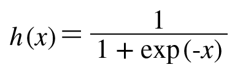

# 신경망
가중치 매개변수의 적절한 값을 데이터로부터 자동으로 학습하는 능력이 신경망의 중요한 성질
## 3.1 퍼셉트론에서 신경망으로
### 3.1.1 신경망의 예
- 신경망의 예  
  
    - 가장 왼쪽 줄을 입력층
    - 맨 오른쪽 줄을 출력층
    - 중간 줄을 은닉층
    - 은닉층의 뉴런은 사람 눈에는 보이지 않음
### 3.1.2 퍼셉트론 복습
- 편향을 명시한 퍼셉트론  
  
- 함수로 표현  
  
  
### 3.1.3 활성화 함수의 등장
- 입력 신호의 총합을 출력 신호로 변환하는 함수를 일반적으로 활성화 함수라 함
- 가중치가 곱해진 입력 신호의 총합을 계산하고, 그 합을 활성화 함수에 입력해 결과를 내는 2단계로 처리
- 활성화 함수의 처리 과정  
  
    - 가중치 신호를 조합한 결과가 a라는 노드가 됨
    - 활성화 함수 h()를 통과
    - y라는 노드로 변환되는 과정
## 3.2 활성화 함수
- > "퍼셉트론에서는 활성화 함수로 계단 함수를 이용한다."
### 3.2.1 시그모이드 함수
- 시그모이드 함수를 나타낸 식  
  
- 신경망에서는 활성화 함수로 시그모이드 함수를 이용하여 신호를 변환
- 그 변환된 신호를 다음 뉴런에 전달
### 3.2.2 계단 함수 구현하기
```python
def step_function(x):
    if x > 0:
        return 1
    else:
        return 0
```
```python
def step_function(x):
    y = x > 0
    return y.astype(np.int)
```
### 3.2.3 계단 함수의 그래프
- [step_function](step_function.py)  
  
### 3.2.4 시그모이드 함수 구현하기
```python
def sigmoid(x):
    return 1 / (1 + np.exp(-x))
```
- [sigmoid](sigmoid.py)  
  
### 3.2.5 시그모이드 함수와 계단 함수 비교
- 계단 함수와 시그모이드 함수
- [sig_step_compare](sig_step_compare.py)  
  
- '매끄러움'의 차이
    - 시그모이드 함수는 부드러운 곡선이며 입력에 따라 출력이 연속적으로 변화
    - 계단 함수는 0을 경계로 출력이 갑자기 바뀜
- 입력이 작을 때의 출력은 0에 가까움 (혹은 0임)
- 입력이 커지면 출력이 1에 가까워짐 (혹은 1임) 구조
- 입력이 중요하면 큰 값을 출력 / 입력이 중요하지 않으면 작은 값을 출력
- 입력이 아무리 작거나 커도 출력은 0에서 1 사이
### 3.2.6 비선형 함수
- 계단 함수와 시그모이드 함수는 모두 비선형 함수
- 신경망에서는 활성화 함수로 비선형 함수를 사용해야 함
    - 선형 함수를 이용하면 층을 깊게 하는 의미가 없어짐
    - 층을 쌓는 혜택을 얻으려면 반드시 비선형 함수를 사용해야 함
 ### 3.2.7 ReLU 함수
 - ReLU는 입력이 0을 넘으면 그 입력을 그대로 출력
 - 0 이하이면 0을 출력하는 함수
 - ReLU 함수의 그래프  
  
 - ReLU 함수의 수식  
  
- [relu](relu.py)  
  