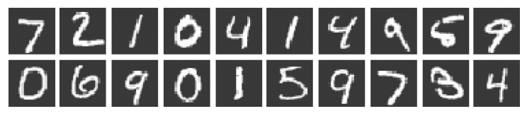
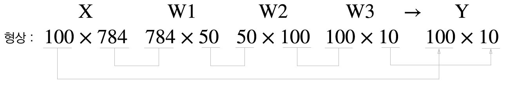

# 신경망
가중치 매개변수의 적절한 값을 데이터로부터 자동으로 학습하는 능력이 신경망의 중요한 성질
## 3.1 퍼셉트론에서 신경망으로
### 3.1.1 신경망의 예
- 신경망의 예  
  
    - 가장 왼쪽 줄을 입력층
    - 맨 오른쪽 줄을 출력층
    - 중간 줄을 은닉층
    - 은닉층의 뉴런은 사람 눈에는 보이지 않음
### 3.1.2 퍼셉트론 복습
- 편향을 명시한 퍼셉트론  
  
- 함수로 표현  
  
  
### 3.1.3 활성화 함수의 등장
- 입력 신호의 총합을 출력 신호로 변환하는 함수를 일반적으로 활성화 함수라 함
- 가중치가 곱해진 입력 신호의 총합을 계산하고, 그 합을 활성화 함수에 입력해 결과를 내는 2단계로 처리
- 활성화 함수의 처리 과정  
  
    - 가중치 신호를 조합한 결과가 a라는 노드가 됨
    - 활성화 함수 h()를 통과
    - y라는 노드로 변환되는 과정
## 3.2 활성화 함수
- > "퍼셉트론에서는 활성화 함수로 계단 함수를 이용한다."
### 3.2.1 시그모이드 함수
- 시그모이드 함수를 나타낸 식  
  
- 신경망에서는 활성화 함수로 시그모이드 함수를 이용하여 신호를 변환
- 그 변환된 신호를 다음 뉴런에 전달
### 3.2.2 계단 함수 구현하기
```python
def step_function(x):
    if x > 0:
        return 1
    else:
        return 0
```
```python
def step_function(x):
    y = x > 0
    return y.astype(np.int)
```
### 3.2.3 계단 함수의 그래프
- [step_function](step_function.py)  
  
### 3.2.4 시그모이드 함수 구현하기
```python
def sigmoid(x):
    return 1 / (1 + np.exp(-x))
```
- [sigmoid](sigmoid.py)  
  
### 3.2.5 시그모이드 함수와 계단 함수 비교
- 계단 함수와 시그모이드 함수
- [sig_step_compare](sig_step_compare.py)  
  
- '매끄러움'의 차이
    - 시그모이드 함수는 부드러운 곡선이며 입력에 따라 출력이 연속적으로 변화
    - 계단 함수는 0을 경계로 출력이 갑자기 바뀜
- 입력이 작을 때의 출력은 0에 가까움 (혹은 0임)
- 입력이 커지면 출력이 1에 가까워짐 (혹은 1임) 구조
- 입력이 중요하면 큰 값을 출력 / 입력이 중요하지 않으면 작은 값을 출력
- 입력이 아무리 작거나 커도 출력은 0에서 1 사이
### 3.2.6 비선형 함수
- 계단 함수와 시그모이드 함수는 모두 비선형 함수
- 신경망에서는 활성화 함수로 비선형 함수를 사용해야 함
    - 선형 함수를 이용하면 층을 깊게 하는 의미가 없어짐
    - 층을 쌓는 혜택을 얻으려면 반드시 비선형 함수를 사용해야 함
 ### 3.2.7 ReLU 함수
 - ReLU는 입력이 0을 넘으면 그 입력을 그대로 출력
 - 0 이하이면 0을 출력하는 함수
 - ReLU 함수의 그래프  
  
 - ReLU 함수의 수식  
  
- [relu](relu.py)  
  
## 3.3 다차원 배열의 계산
### 3.3.1 다차원 배열
- 2차원 배열은 행렬이라고 부름
- 배열의 가로 방향을 행
- 배열의 세로 방향을 열  
  
### 3.3.2 행렬의 곱
- 행렬의 곱 계산 방법  
  
- 행렬의 곱에서는 피연산자의 순서가 다르면 결과도 다름
- 행렬 A의 1번째 차원의 원소 수(열 수)와 행렬 B의 0번째 차원의 원소 수(행 수)가 같아야 함  
  
- 계산 결과의 형상은 A의 행 수와 B의 열 수가 됨
### 3.3.3 신경망에서의 행렬 곱
- 행렬의 곱으로 신경망의 계산을 수행  
  
## 3.4 3층 신경망 구현하기
### 3.4.1 표기법 설명
  
### 3.4.2 각 층의 신호 전달 구현하기
  
  
  
### 3.4.3 구현 정리
```python
def init_network():
    network = {}
    network['W1'] = np.array([[0.1, 0.3, 0.5], [0.2, 0.4, 0.6]])
    network['b1'] = np.array([0.1, 0.2, 0.3])
    network['W2'] = np.array([[0.1, 0.4], [0.2, 0.5], [0.3, 0.6]])
    network['b2'] = np.array([0.1, 0.2])
    network['W3'] = np.array([[0.1, 0.3], [0.2, 0.4]])
    network['b3'] = np.array([0.1, 0.2])

    return network

def forward(network, x):
    W1, W2, W3 = network['W1'], network['W2'], network['W3']
    b1, b2, b3 = network['b1'], network['b2'], network['b3']

    a1 = np.dot(x, W1) + b1
    z1 = sigmoid(a1)
    a2 = np.dot(z1, W2) + b2
    z2 = sigmoid(a2)
    a3 = np.dot(z2, W3) + b3
    y = idetity_function(a3)

    return y

network = init_network()
x = np.array([1.0, 0.5])
y = forward(network, x)
print(y) # [0.31682708, 0.69627909]
```
## 3.5 출력층 설계하기
### 3.5.1 항등 함수와 소프트맥스 함수 구현하기
- 항등 함수는 입력을 그대로 출력  
  
- 소프트맥수 함수 식  
  
- 소프트맥스 함수  
  
### 3.5.2 소프트맥스 함수 구현 시 주의점
- 오버플로 문제
```python
def softmax(a):
    c = np.max(a)
    exp_a = np.exp(a-c) # 오버플로 대책
    sum_exp_a = np.sum(exp_a)
    y = exp_a / sum_exp_a

    return y
```
### 3.5.3 소프트맥스 함수의 특징
- 소프트맥스 함수의 출력은 0에서 1.0 사이의 실수
- 소프트맥스 함수 출력의 총합은 1
- 소프트맥스 함수를 이용함으로써 문제를 확률적(통계적)으로 대응할 수 있게 됨
- 소프트맥스 함수를 적용해도 각 원소의 대소 관계는 변하지 않음
- 신경망으로 분류할 때는 출력층의 소프트맥스 함수를 생략해도 됨
### 3.5.4 출력층의 뉴련 수 정하기
- 출력층의 뉴런 수는 풀려는 문제에 맞게 적절히 정해야 함
## 3.6 손글씨 숫자 인식
### 3.6.1 MNIST 데이터셋
- MNIST 이미지 데이터셋의 예  
  
- [mnist_show](mnist_show.py)  
  
### 3.6.2 신경망의 추론 처리
- [neuralnet_mnist](neuralnet_mnist.py)  
### 3.6.3 배치 처리
- 신경망 각 층의 배열 형상의 추이  
  
- 배치 처리를 위한 배열들의 형상의 추이  
  
- 하나로 묶은 입력 데이터를 배치라 함
- [neuralnet_mnist_batch](neuralnet_mnist_batch.py)  
## 3.7 정리
> **이번 장에서 배운 내용**
* 신경망에서는 활성화 함수로 시그모이드 함수와 ReLU 함수 같은 매끄럽게 변화하는 함수를 이용한다.
* 넘파이의 다차원 배열을 잘 사용하면 신경망을 효율적으로 구현할 수 있다.
* 기계학습 문제는 크게 회귀와 분류로 나눌 수 있다.
* 출력층의 활성화 함수로는 회귀에서는 주로 항등 함수를, 분류에서는 주로 소프트맥스 함수를 이용한다.
* 분류에서는 출력층의 뉴런 수를 분류하려는 클래스 수와 같게 설정한다.
* 입력 데이터를 묶은 것을 배치라 하며, 추론 처리를 이 배치 단위로 진행하면 결과를 훨씬 빠르게 얻을 수 있다.