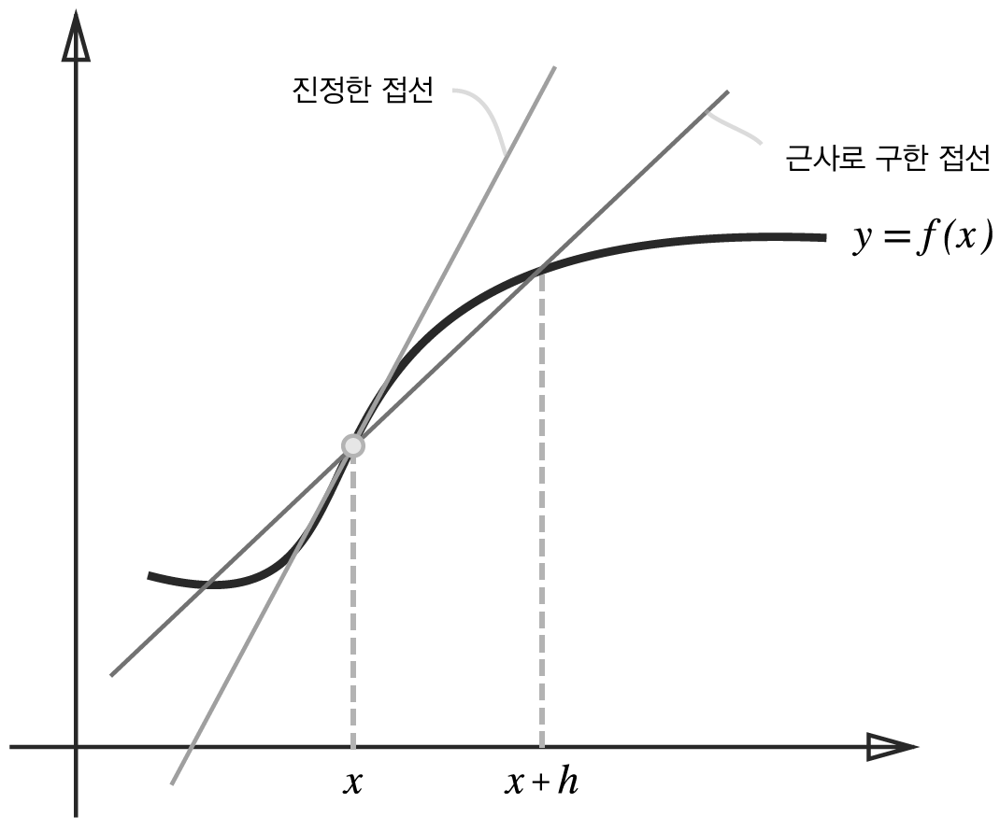
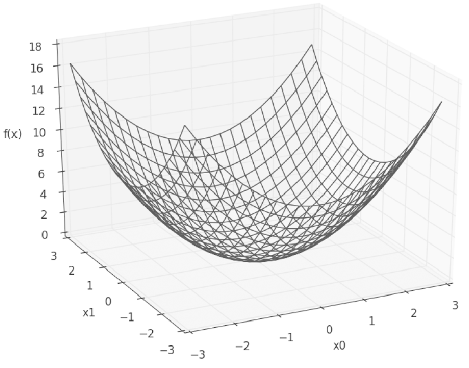

# 신경망 학습
- 학습이란 훈련 데이터로부터 가중치 매개변수의 최적값을 자동으로 획득하는 것
## 4.1 데이터에서 학습한다!
- 신경망의 특징은 데이터를 보고 학습할 수 있다는 점
- 데이터에서 학습한다는 것은 가중치 매개변수의 값을 데이터를 보고 자동으로 결정한다는 뜻
###  4.1.1 데이터 주도 학습
- 기계학습의 중심에는 데이터가 존재
- 이미지에서 특징을 추출하고 그 특징의 패턴을 기계학습 기술로 학습
- 특징을 사용하여 이미지 데이터를 벡터로 변환하고, 변환된 벡터를 가지고 지도 학습 방식의 대표 분류 기법인 SVM, KNN 등으로 학습할 수 있음
- 기계학습에서는 모아진 데이터로부터 규칙을 찾아내는 역할을 '기계'가 담당
- 문제에 적합한 특징을 쓰지 않으면(혹은 특징을 설계하지 않으면) 좀처럼 좋은 결과를 얻을 수 없음
- 규칙을 사람이 만드는 방식에서 기계가 데이터로부터 배우는 방식  
  
- 신경망은 모든 문제를 주어진 데이터 그대로를 입력 데이터로 활용해 'end-to-end'로 학습할 수 있음
### 4.1.2 훈련 데이터와 시험 데이터
- 기계학습 문제는 데이터를 훈련 데이터와 시험 데이터로 나눠 학습과 실험을 수행하는 것이 일반적
- 범용 능력을 제대로 평가하기 위해 훈련 데이터와 시험 데이터를 분리
- 범용 능력은 아직 보지 못한 데이터(훈련 데이터에 포함되지 않는 데이터)로도 문제를 올바르게 풀어내는 능력
- 한 데이터셋에만 지나치게 최적화된 상태를 오버피팅이라고 함
## 4.2 손실 함수
- 신경망 학습에서는 현재의 상태를 '하나의 지표'로 표현
- 신경망도 '하나의 지표'를 기준으로 최적의 매개변수 값을 탐색
- 신경망 학습에서 사용하는 지표는 손실 함수라고 함
- 일반적으로 오차제곱합과 교차 엔트로피 오차를 사용함
### 4.2.1 오차제곱합
- 가장 많이 쓰이는 손실 함수는 오차제곱합임
- 오차제곱합 수식  
  
- 오차제곱합은 각 원소의 출력(추정 값)과 정답 레이블(참 값)의 차를 제곱한 후, 그 총합을 구함
### 4.2.2 교차 엔트로피 오차
- 교차 엔트로피 오차 수식  
  
### 4.2.3 미니배치 학습
- 모든 훈련 데이터를 대상으로 손실 함수 값을 구해야 함
- 교차 엔트로피 오차 수식  
  
- 훈련 데이터로부터 일부만 골라 학습을 수행. 이 일부를 미니배치라고 함
### 4.2.4 (배치용)교차 엔트로피 오차 구현하기
```python
def cross_entropy_error(y, t):
  if y.ndim == 1:
    t = t.reshape(1, t.size)
    y = y.reshape(1, y.size)
  
  batch_size = y.shape[0]
  return -np.sum(t * np.log(y + 1e-7)) / batch_size
  ```
  ```python
  def cross_entropy_error(y, t):
  if y.ndim == 1:
    t = t.reshape(1, t.size)
    y = y.reshape(1, y.size)
  
  batch_size = y.shape[0]
  return -np.sum(np.log(y[np.arange(batch_size), t] + 1e-7)) / batch_size
  ```
  ### 4.2.5 왜 손실 함수를 설정하는가?
  - 매개변수의 미분(기울기)을 계산하고, 그 미분 값을 단서로 매개변수 값을 서서히 갱신하는 과정을 반복
  - 기울기가 0이 되지 않는 덕분에 신경망이 올바르게 학습할 수 있음
  ## 4.3 수치 미분
  ### 4.3.1 미분
  
- 반올림 오차는 작은 값(가령 소수점 8자리 이하)이 생략되어 최종 계산 결과에 오차가 생기게 함
- 진정한 미분(진정한 접선)과 수치 미분(근사로 구한 접선)의 값은 다름  
  
- x를 중심으로 그 전후의 차분을 계산한다는 의미에서 중심 차분 혹은 중앙 차분이라 함
### 4.3.2 수치 미분의 예
- 2차 함수 예  
  
- [gradient_1d](gradient_1d.py)  
  
### 4.3.3 편미분
  
  
- 변수가 여럿인 함수에 대한 미분을 편미분이라 함
- 편미분은 변수가 하나인 미분과 마찬가지로 특정 장소의 기울기를 구함
- 단, 여러 변수 중 목표 변수 하나에 초점을 맞추고 다른 변수는 값을 고정함
## 4.4 기울기
- 모든 변수의 편미분을 벡터로 정리한 것을 기울기라고 함
- [gradient_2d](gradient_2d.py)  
  
- 기울기가 가리키는 쪽은 각 장소에서 함수의 출력 값을 가장 크게 줄이는 방향
### 4.4.1 경사법(경사 하강법)
- 최적이란 손실 함수가 최솟값이 될 떄의 매개변수 값
- 기울기를 잘 이용해 함수의 최솟값(또는 가능한 한 작은 값)을 찾으려는 것이 경사법임
- 각 지점에서 함수의 값을 낮추는 방안을 제시하는 지표가 기울기
- 복잡한 함수에서는 기울기가 가리키는 방향에 최솟값이 없는 경우가 대부분임
- 현 위치에서 기울어진 방향으로 일정 거리만큼 이동, 그런 다음 이동한 곳에서도 기울기를 구하고, 또 그 기울어진 방향으로 나아가기를 반복
- 이렇게 해서 함수의 값을 점차 줄이는 것이 경사법
- 경사법은 기계학습을 최적화하는 데 흔히 쓰는 방법. 특히 신경망 학습에서는 경사법을 많이 사용함
- 경사법 수식  
  
- η는 갱신하는 양을 나타냄. 이를 신경망 학습에서는 학습률이라고 함
- 매개변수 값을 얼마나 갱신하느냐를 정하는 것이 학습률
- [gradient_method](gradient_method.py)  
  
- 학습률이 너무 크면 큰 값으로 발산함
- 반대로 너무 작으면 거의 갱신되지 않은 채 끝남
### 4.4.2 신경망에서의 기울기
- 신경망 학습에서도 가중치 매개변수에 대한 손실 함수의 기울기를 구해야 함
- 손실 함수의 기울기 수식  
  
- [gradient_simplenet](gradient_simplenet.py)  
## 4.5 학습 알고리즘 구현하기
- 신경망 학습 절차
    - 1단계 - 미니배치
    - 2단계 - 기울기 산출
    - 3단계 - 매개변수 갱신
    - 4단계 - 반복
- 데이터를 미니배치로 무작위로 선정하기 때문에 확률적 경사 하강법이라고 부름
- 대부분의 딥러닝 프레임워크는 확률적 경사 하강법의 영어 머리글자를 딴 SGD라는 함수로 이 기능을 구현하고 있음
### 4.5.1 2층 신경망 클래스 구현하기
- 2층 신경망을 하나의 클래스로 구현
- [two_layer_net](two_layer_net.py)  
### 4.5.2 미니배치 학습 구현하기
- [train_neuralnet](train_neuralnet.py)  
- 손실 함수 값의 추이  
  
### 4.5.3 시험 데이터로 평가하기
  
## 4.6 정리
> **이번 장에서 배운 내용**
* 기계학습에서 사용하는 데이터셋은 훈련 데이터와 시험 데이터로 나눠 사용한다.
* 훈련 데이터로 학습한 모델의 범용 능력을 시험 데이터로 평가한다.
* 신경망 학습은 손실 함수를 지표로, 손실 함수의 값이 작아지는 방향으로 가중치 매개변수를 갱신한다.
* 가중치 매개변수를 갱신할 때는 가중치 매개변수의 기울기를 이용하고, 기울어진 방향으로 가중치의 값을 갱신하는 작업을 반복한다.
* 아주 작은 값을 주었을 때의 차분으로 미분하는 것을 수치 미분이라고 한다.
* 수치 미분을 이용해 가중치 매개변수의 기울기를 구할 수 있다.
* 수치 미분을 이용한 계산에는 시간이 걸리지만, 그 구현은 간단하다. 한편, 다음 장에서 구현하는 (다소 복잡한) 오차역전파법은 기울기를 고속으로 구할 수 있다.