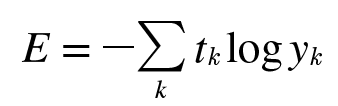

# 신경망 학습
- 학습이란 훈련 데이터로부터 가중치 매개변수의 최적값을 자동으로 획득하는 것
## 4.1 데이터에서 학습한다!
- 신경망의 특징은 데이터를 보고 학습할 수 있다는 점
- 데이터에서 학습한다는 것은 가중치 매개변수의 값을 데이터를 보고 자동으로 결정한다는 뜻
###  4.1.1 데이터 주도 학습
- 기계학습의 중심에는 데이터가 존재
- 이미지에서 특징을 추출하고 그 특징의 패턴을 기계학습 기술로 학습
- 특징을 사용하여 이미지 데이터를 벡터로 변환하고, 변환된 벡터를 가지고 지도 학습 방식의 대표 분류 기법인 SVM, KNN 등으로 학습할 수 있음
- 기계학습에서는 모아진 데이터로부터 규칙을 찾아내는 역할을 '기계'가 담당
- 문제에 적합한 특징을 쓰지 않으면(혹은 특징을 설계하지 않으면) 좀처럼 좋은 결과를 얻을 수 없음
- 규칙을 사람이 만드는 방식에서 기계가 데이터로부터 배우는 방식  
  
- 신경망은 모든 문제를 주어진 데이터 그대로를 입력 데이터로 활용해 'end-to-end'로 학습할 수 있음
### 4.1.2 훈련 데이터와 시험 데이터
- 기계학습 문제는 데이터를 훈련 데이터와 시험 데이터로 나눠 학습과 실험을 수행하는 것이 일반적
- 범용 능력을 제대로 평가하기 위해 훈련 데이터와 시험 데이터를 분리
- 범용 능력은 아직 보지 못한 데이터(훈련 데이터에 포함되지 않는 데이터)로도 문제를 올바르게 풀어내는 능력
- 한 데이터셋에만 지나치게 최적화된 상태를 오버피팅이라고 함
## 4.2 손실 함수
- 신경망 학습에서는 현재의 상태를 '하나의 지표'로 표현
- 신경망도 '하나의 지표'를 기준으로 최적의 매개변수 값을 탐색
- 신경망 학습에서 사용하는 지표는 손실 함수라고 함
- 일반적으로 오차제곱합과 교차 엔트로피 오차를 사용함
### 4.2.1 오차제곱합
- 가장 많이 쓰이는 손실 함수는 오차제곱합임
- 오차제곱합 수식  
  
- 오차제곱합은 각 원소의 출력(추정 값)과 정답 레이블(참 값)의 차를 제곱한 후, 그 총합을 구함
### 4.2.2 교차 엔트로피 오차
- 교차 엔트로피 오차 수식  
  
### 4.2.3 미니배치 학습
- 모든 훈련 데이터를 대상으로 손실 함수 값을 구해야 함
- 교차 엔트로피 오차 수식  
  
- 훈련 데이터로부터 일부만 골라 학습을 수행. 이 일부를 미니배치라고 함
### 4.2.4 (배치용)교차 엔트로피 오차 구현하기
```python
def cross_entropy_error(y, t):
  if y.ndim == 1:
    t = t.reshape(1, t.size)
    y = y.reshape(1, y.size)
  
  batch_size = y.shape[0]
  return -np.sum(t * np.log(y + 1e-7)) / batch_size
  ```
  ```python
  def cross_entropy_error(y, t):
  if y.ndim == 1:
    t = t.reshape(1, t.size)
    y = y.reshape(1, y.size)
  
  batch_size = y.shape[0]
  return -np.sum(np.log(y[np.arange(batch_size), t] + 1e-7)) / batch_size
  ```
  ### 4.2.5 왜 손실 함수를 설정하는가?
  - 매개변수의 미분(기울기)을 계산하고, 그 미분 값을 단서로 매개변수 값을 서서히 갱신하는 과정을 반복
  - 기울기가 0이 되지 않는 덕분에 신경망이 올바르게 학습할 수 있음
  