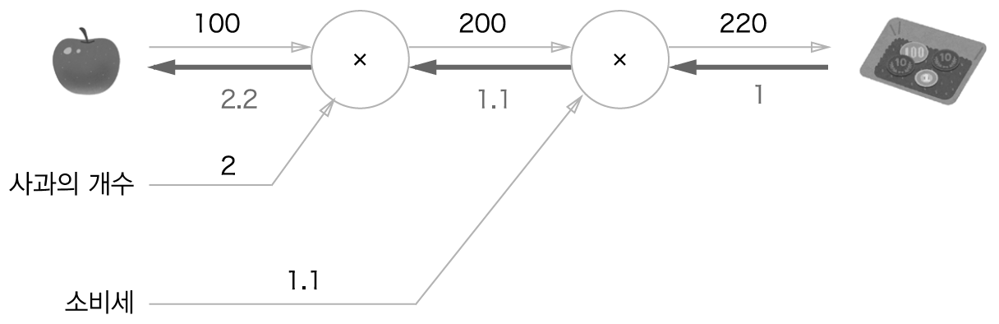

# 오차역전파법
- 수치 미분은 단순하고 구현하기도 쉽지만 계산 시간이 오래 걸린다는 게 단점
- 가중치 매개변수의 기울기를 효율적으로 계산하는 '오차역전파법'
## 5.1 계산 그래프
- 계산 그래프는 계산 과정을 그래프로 나타낸 것
- 그래프는 복수의 노드와 에지로 표현됨
### 5.1.1 계산 그래프로 풀다
- 계산 그래프는 계산 과정을 노드와 화살표로 표현
- 계산 그래프로 풀어본 문제 1의 답  
  
- '사과의 개수'와 '소비세'를 변수로 취급해 원 밖에 표기  
  
- 계산 그래프로 풀어본 문제 2의 답  
  
- 계산 그래프를 이용한 문제풀이는 다음 흐름으로 진행
    1. 계산 그래프를 구성한다.
    2. 그래프에서 계산을 왼쪽에서 오른쪽으로 진행한다.
- '계산을 왼쪽에서 오른쪽으로 진행'하는 단계를 순전파
### 5.1.2 국소적 계산
- 계산 그래프의 특징은 '국소적 계산'을 전파함으로써 최종 결과를 얻는다는 점
- 국소적 계산은 전체에서 어떤 일이 벌어지든 상관없이 자신과 관계된 정보만으로 결과를 출력할 수 있다는 것
- 사과 2개를 포함해 여러 식품을 구입하는 예  
  
- 국소적인 계산은 단순하지만, 그 결과를 전달함으로써 전체를 구성하는 복잡한 계산을 해낼 수 있음
### 5.1.3 왜 계산 그래프로 푸는가?
- 계산 그래프의 이점
    1. '국소적 계산'
    2. 중간 계산 결과를 모두 보관할 수 있음
- 계산 그래프를 사용하는 가장 큰 이유는 역전파를 통해 '미분'을 효율적으로 계산할 수 있는 점에 있음
- 역전파에 의한 미분 값의 전달  
  
- 계산 그래프의 이점은 순전파와 역전파를 활용해서 각 변수의 미분을 효율적으로 구할 수 있다는 것
