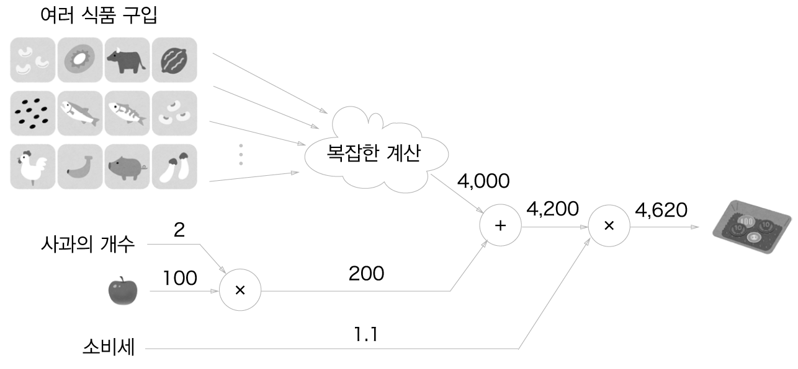
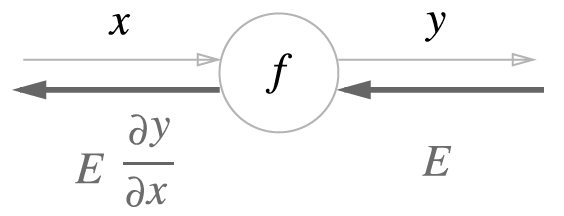
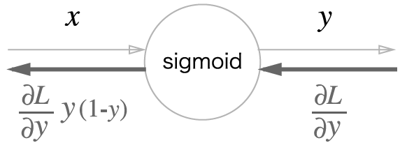

# 오차역전파법
- 수치 미분은 단순하고 구현하기도 쉽지만 계산 시간이 오래 걸린다는 게 단점
- 가중치 매개변수의 기울기를 효율적으로 계산하는 '오차역전파법'
## 5.1 계산 그래프
- 계산 그래프는 계산 과정을 그래프로 나타낸 것
- 그래프는 복수의 노드와 에지로 표현됨
### 5.1.1 계산 그래프로 풀다
- 계산 그래프는 계산 과정을 노드와 화살표로 표현
- 계산 그래프로 풀어본 문제 1의 답  
  
- '사과의 개수'와 '소비세'를 변수로 취급해 원 밖에 표기  
  
- 계산 그래프로 풀어본 문제 2의 답  
  
- 계산 그래프를 이용한 문제풀이는 다음 흐름으로 진행
    1. 계산 그래프를 구성한다.
    2. 그래프에서 계산을 왼쪽에서 오른쪽으로 진행한다.
- '계산을 왼쪽에서 오른쪽으로 진행'하는 단계를 순전파
### 5.1.2 국소적 계산
- 계산 그래프의 특징은 '국소적 계산'을 전파함으로써 최종 결과를 얻는다는 점
- 국소적 계산은 전체에서 어떤 일이 벌어지든 상관없이 자신과 관계된 정보만으로 결과를 출력할 수 있다는 것
- 사과 2개를 포함해 여러 식품을 구입하는 예  
  
- 국소적인 계산은 단순하지만, 그 결과를 전달함으로써 전체를 구성하는 복잡한 계산을 해낼 수 있음
### 5.1.3 왜 계산 그래프로 푸는가?
- 계산 그래프의 이점
    1. '국소적 계산'
    2. 중간 계산 결과를 모두 보관할 수 있음
- 계산 그래프를 사용하는 가장 큰 이유는 역전파를 통해 '미분'을 효율적으로 계산할 수 있는 점에 있음
- 역전파에 의한 미분 값의 전달  
  
- 계산 그래프의 이점은 순전파와 역전파를 활용해서 각 변수의 미분을 효율적으로 구할 수 있다는 것
## 5.2 연쇄법칙
- 역전파는 '국소적인 미분'을 순방향과는 반대인 오른쪽에서 왼쪽으로 전달
- 이 '국소적 미분'을 전달하는 원리는 연쇄법칙에 따른 것
### 5.2.1 계산 그래프의 역전파
- 계산 그래프의 역전파: 순방향과는 반대 방향으로 국소적 미분을 곱함  
  
### 5.2.2 연쇄법칙이란?
- 합성 함수란 여러 함수로 구성된 함수
- 합성 함수 예  
  
- 연쇄법칙은 합성 함수의 미분에 대한 성질이며, 다음과 같이 정의됨
    > 합성 함수의 미분은 합성 함수를 구성하는 각 함수의 미분의 곱으로 나타낼 수 있다.  

  
  
  
### 5.2.3 연쇄법칙과 계산 그래프
- e5.4의 계산 그래프  
  
  
## 5.3 역전파
### 5.3.1 덧셈 노드의 역전파
- z = x + y의 미분은 다음과 같이 해석적으로 계산할 수 있음  
  
  
- 덧셈 노드의 역전파는 1을 곱하기만 할 뿐이므로 입력된 값을 그대로 다음 노드로 보내게 됨
### 5.3.2 곱셈 노드의 역전파
- z = xy의 미분은 다음과 같음  
  
  
- 곱셈 노드 역전파는 상류의 값에 순전파 때의 입력 신호들을 '서로 바꾼 값'을 곱해서 하류로 보냄
- 곱셈 노드를 구현할 때는 순전파의 입력 신호를 변수에 저장해둠
### 5.3.3 사과 쇼핑의 예
- 사과 쇼핑의 역전파 예  
  
- 사과와 귤 쇼핑의 역전파 예  
  
## 5.4 단순한 계층 구현하기
### 5.4.1 곱셈 계층
- 모든 계층은 forward()와 backward()라는 공통의 메서드(인터페이스)를 갖도록 구현
- forward()는 순전파, backward()은 역전파를 처리
- [layer_naive](layer_naive.py)  
  
- [buy_apple](buy_apple.py)  
- backward() 호출 순서는 forward() 때와는 반대
- backward()가 받는 인수는 '순전파의 출력에 대한 미분'임에 주의
### 5.4.2 덧셈 계층
- [layer_naive](layer_naive.py)  
  
- [buy_apple_orange](buy_apple_orange.py)  
## 5.5 활성화 함수 계층 구현하기
### 5.5.1 ReLU 계층
- 활성화 함수로 사용되는 ReLU의 수식은 다음과 같음  
  
- x에 대한 y의 미분  
  
- ReLU 계층의 계산 그래프  
  
```python
class Relu:
    def __init__(self):
        self.mask = None
    
    def forward(self, x):
        self.mask = (x <= 0)
        out = x.copy()
        out[self.mask] = 0

        return out

    def backward(self, dout):
        dout[self.mask] = 0
        dx = dout

        return dx
```
### 5.5.2 Sigmoid 계층
- 시그모이드 함수는 다음 식을 의미하는 함수  
  
- Sigmoid 계층의 계산 그래프(순전파)  
  
- 역전파의 흐름을 오른쪽에서 왼쪽으로 한 단계씩 짚어봄
- 1 단계
- y = 1/x을 미분  
  
.png)  
- 2 단계  
.png)  
- 3 단계
- y = exp(x) 미분  
  
.png)  
- 4 단계
- Sigmoid 계층의 계산 그래프  
  
- Sigmoid 계층의 계산 그래프(간소화 버전)  
  
  
- Sigmoid 계층의 역전파는 순전파의 출력(y)만으로 계산할 수 있음
- Sigmoid 계층의 계산 그래프: 순전파의 출력 y만으로 역전파를 계산할 수 있음  
  
```python
class Sigmoid:
  def __init__(self):
    self.out = None
  
  def forward(self, x):
    out = 1 / (1 + np.exp(-x))
    self.out = out

    return out
  
  def backward(self, dout):
    dx = dout * (1.0 - self.out) * self.out
    
    return dx
```
